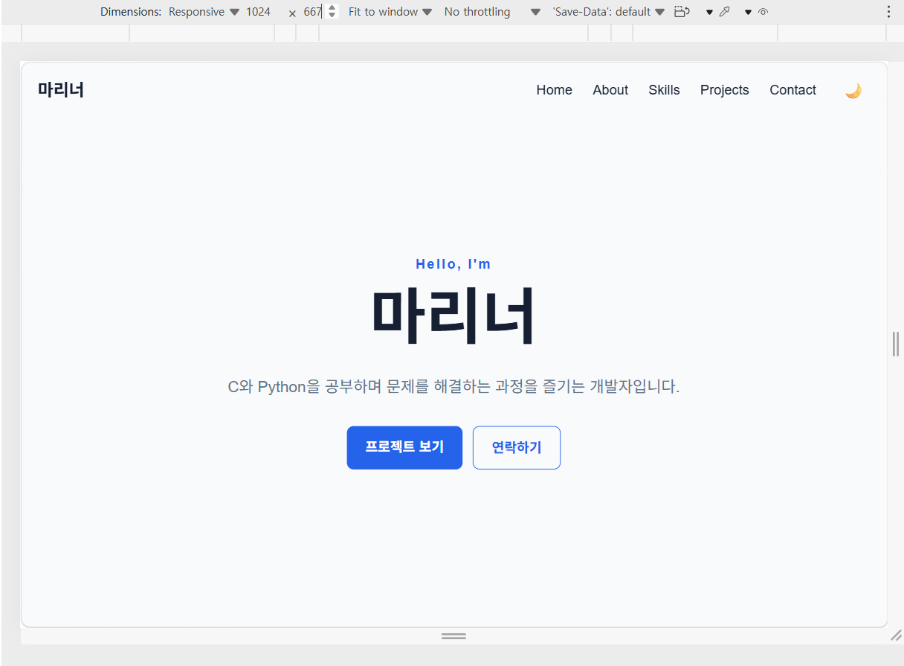
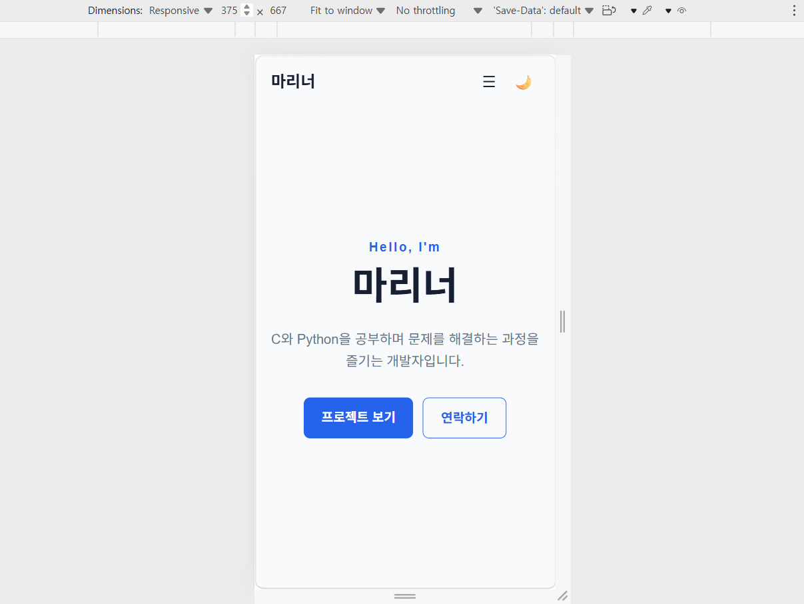
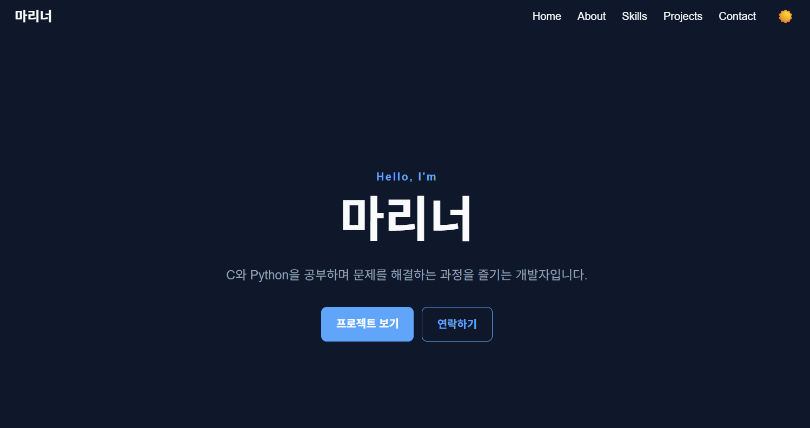

# 마리너 | Portfolio

개인 프로필과 기술 스택, GitHub 프로젝트를 소개하는 반응형 포트폴리오 웹사이트입니다.

## 🌐 배포 사이트

https://signup-forme.github.io/FirstPort/

## 🛠️ Tech Stack

- HTML5
- CSS3
- Vanilla JavaScript
- GitHub REST API
- GitHub Pages

## ✨ 주요 기능

- 반응형 포트폴리오 디자인
- 모바일 햄버거 메뉴
- 다크 모드
- 다크 모드 설정 LocalStorage 저장
- 스크롤에 따른 헤더 스타일 변경
- 스크롤 Top 버튼
- IntersectionObserver를 이용한 섹션 등장 애니메이션
- Contact Form 입력값 검증
- GitHub API를 이용한 Repository 자동 불러오기
- GitHub API Loading / Success / Error / Empty 상태 처리

## 📱 반응형

다음 화면 크기를 기준으로 반응형 레이아웃을 구현했습니다.

- Mobile: 375px
- Tablet: 768px
- Desktop: 1024px 이상

## 🔌 GitHub API

GitHub REST API를 사용하여 `signup-forme` 계정의 Repository를 불러옵니다.

API 요청 결과에 따라 다음 상태를 표시합니다.

1. Loading
2. Success
3. Empty
4. Error

## 💡 주요 JavaScript 구현

### Event → State → Render

다음과 같은 사용자 상호작용을 JavaScript로 구현했습니다.

- 햄버거 메뉴 → 메뉴 상태 변경 → 메뉴 렌더링
- 다크 모드 → 테마 상태 변경 → 화면 테마 변경
- 스크롤 → 스크롤 상태 변경 → 헤더 / Scroll Top 버튼 변경
- GitHub API → Loading / Success / Error 상태 → 프로젝트 목록 렌더링
- Contact Form → 입력 검증 상태 → 오류 / 성공 메시지 렌더링

## 👨‍💻 About

안녕하세요. 마리너입니다.

새로운 기술을 배우고 직접 코드를 작성하면서 문제를 해결하는 과정을 좋아합니다. 현재는 C와 Python을 중심으로 프로그래밍의 기본기를 탄탄하게 다지는 데 집중하고 있습니다.

작은 프로그램이라도 직접 설계하고 구현하면서 한 단계씩 성장하는 개발자가 되는 것이 목표입니다.

## 📚 Skills

- C
- Python

## 📸 Screenshots

### Desktop

### Mobile

### Dark Mode

## 📄 License

개인 포트폴리오 프로젝트입니다.